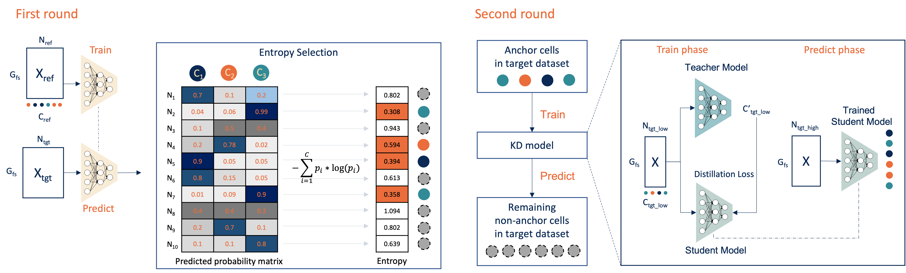

## Cellcano Tutorial

**Authors:** Wenjing Ma (wenjing.ma@emory.edu), Dr. Hao Wu (hao.wu@emory.edu), Emory University
**Latest revision:** 05-15-2022

In this tutorial, we will guide you through Cellcano, a supervised cell type annotation (celltyping) tool in scATAC-seq. We will use human Peripheral Blood Mononuclear Cells (PBMC) datasets as examples. 



We are aiming at accurate and efficient celltyping in single cell genomics, including scRNA-seq, scATAC-seq, scBS-seq, etc. If you are interested, stay tuned!

### 1. Download and process sample scATAC-seq raw data

#### Reference dataset
First, we take a healthy donor `PBMC_Rep1` from [GSE129785](https://www.ncbi.nlm.nih.gov/geo/query/acc.cgi?acc=GSE129785) to be our reference dataset. This study measures the single-cell chromatin landscape of human immune cell development.

We start by downloading the raw data along with the processed metadata. The raw data is provided on GEO under accession number GSE129785. The metadata needs some preprocessing procedures. The original metadata can be first downloaded from GEO at [GSE129785 GSE129785_scATAC-Hematopoiesis-All.cell_barcodes.txt.gz](https://ftp.ncbi.nlm.nih.gov/geo/series/GSE129nnn/GSE129785/suppl/GSE129785_scATAC-Hematopoiesis-All.cell_barcodes.txt.gz). We extract out individuals related to PBMC using the `Group` column and extract out those cells lying in `PBMC_Rep1` category. Then, we annotate the cluster information according to the [WashU EpiGenome Browser](http://epigenomegateway.wustl.edu/legacy/?genome=hg19&session=HcbHMSgBCc&statusId=28207718) under the `SatPathy, Granja et al 2019 v1` track. For your convenience, we provide the processed metadata with cell types on [Dropbox](https://www.dropbox.com/s/fv2ikhntp80r0ks/GSM3722015_PBMC_Rep1_metadata.csv).

```shell
# create and enter directory
mkdir train_data
cd train_data
# Download sample fragment file
wget https://ftp.ncbi.nlm.nih.gov/geo/samples/GSM3722nnn/GSM3722015/suppl/GSM3722015_PBMC_Rep1_fragments.tsv.gz
# Download processed cell metadata
wget https://www.dropbox.com/s/fv2ikhntp80r0ks/GSM3722015_PBMC_Rep1_metadata.csv
```

Next, we use Cellcano to call ArchR to process the fragment file into gene score matrix. The `-i` option scans files ending with `fragments.tsv.gz` or `.bam` and load the files to ArchR.`-g` describes which genome will be used. `--threads` indicates how many threads will be used to run ArchR. ArchR would take around 30 mins to process the data with threads as 4. 

```shell
python demo.py preprocess -i train_data -o train_data -g hg19 --threads 4

## The output will be..
Output will be written to train_data
R[write to console]:
                                                   / |
                                                 /    \
            .                                  /      |.
            \\\                              /        |.
              \\\                          /           `|.
                \\\                      /              |.
                  \                    /                |\
                  \\#####\           /                  ||
                ==###########>      /                   ||
                 \\##==......\    /                     ||
            ______ =       =|__ /__                     ||      \\\
        ,--' ,----`-,__ ___/'  --,-`-===================##========>
       \               '        ##_______ _____ ,--,__,=##,__   ///
        ,    __==    ___,-,__,--'#'  ==='      `-'    | ##,-/
        -,____,---'       \\####\\________________,--\\_##,/
           ___      .______        ______  __    __  .______
          /   \     |   _  \      /      ||  |  |  | |   _  \
         /  ^  \    |  |_)  |    |  ,----'|  |__|  | |  |_)  |
        /  /_\  \   |      /     |  |     |   __   | |      /
       /  _____  \  |  |\  \\___ |  `----.|  |  |  | |  |\  \\___.
      /__/     \__\ | _| `._____| \______||__|  |__| | _| `._____|


R[write to console]: Setting default number of Parallel threads to 36.

R[write to console]: Setting default number of Parallel threads to 4.

R[write to console]: Setting default genome to Hg19.

...

R[write to console]: 2022-05-15 10:36:13 : (GSM3722015_PBMC_Rep1 : 1 of 1) Finished Creating Arrow File, 31.809 mins elapsed.

...
R[write to console]: 2022-05-15 10:37:39 : Organizing colData, 1.336 mins elapsed.

R[write to console]: 2022-05-15 10:37:39 : Organizing rowData, 1.336 mins elapsed.

R[write to console]: 2022-05-15 10:37:39 : Organizing rowRanges, 1.336 mins elapsed.

R[write to console]: 2022-05-15 10:37:39 : Organizing Assays (1 of 1), 1.336 mins elapsed.

R[write to console]: 2022-05-15 10:37:39 : Constructing SummarizedExperiment, 1.337 mins elapsed.

R[write to console]: 2022-05-15 10:37:40 : Finished Matrix Creation, 1.359 mins elapsed.
```

The gene score matrix will be in the `train_data` folder:

```
- ArchR_genescore.mtx.gz: stores the gene scores in a COO format.
- ArchR_genescore_barcodes.tsv: stores the cell barcodes.
- ArchR_genescore_genes.tsv: stores the gene symbols.
```

#### Target dataset

Here, as an example, we use a FACS-sorted human PBMC scATAC-seq dataset to be our target dataset. The data is provided on [GSE123578](GSE123578). The fragments files are having the suffixes as `fragments.tsv.gz`. 5 human PBMC cell types available: CD19 B cells, CD4 T cells, CD8 T cells, Monocytes and NK cells. In total, 21K cells are available. We downsample 5K cells out of them and provide the gene score matrix on [Dropbox](https://www.dropbox.com/s/e7g9vem3oxt096l/FACS5K_genescore.csv).

```shell
## create and enter directory
mkdir test_data
cd test_data

## download processed target data
wget https://www.dropbox.com/s/e7g9vem3oxt096l/FACS5K_genescore.csv
```

### 2. Pre-train Cellcano's first round

With the preprocessed reference gene score matrix, we can use it as input for training a first-round prediction. 

```shell
## run the training process
python demo.py train -i train_data/ArchR_genescore -m train_data/GSM3722015_PBMC_Rep1_metadata.csv -o output --prefix PBMC_Rep1_trained 

## The output will be
Skipping registering GPU devices...
_utils.<module>: INFO: Num GPUs Available: 0
train.load_train_adata: INFO: Loading data...
 This may take a while depending on your data size..
 
 ...
 
601/601 - 1s - loss: 0.3551 - accuracy: 0.8839
Epoch 49/100
601/601 - 1s - loss: 0.3499 - accuracy: 0.8833
Epoch 50/100
601/601 - 1s - loss: 0.3429 - accuracy: 0.8836
Epoch 51/100
601/601 - 1s - loss: 0.3457 - accuracy: 0.8830
Epoch 52/100
601/601 - 1s - loss: 0.3442 - accuracy: 0.8839
2022-05-15 17:26:51.405652: W tensorflow/python/util/util.cc:348] Sets are not currently considered sequences, but this may change in the future, so consider avoiding using them.
```

