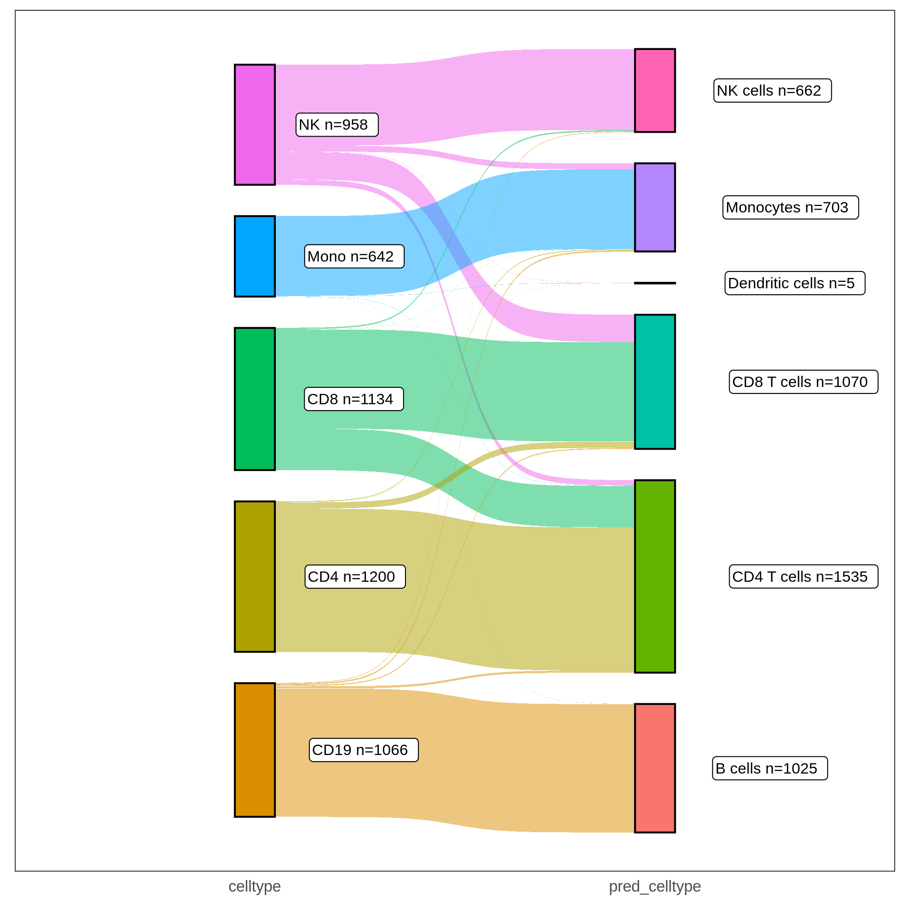

## Cellcano Tutorial

**Authors:** [Wenjing Ma](https://marvinquiet.github.io/) (wenjing.ma@emory.edu), [Jiaying Lu](https://lujiaying.github.io/) (jiaying.lu@emory.edu), [Dr. Hao Wu](http://www.haowulab.org/) (hao.wu@emory.edu), Emory University

**Maintainer:** [Wenjing Ma](https://marvinquiet.github.io/) (wenjing.ma@emory.edu)

**Latest revision:** 06/14/2022

### Introduction

Computational cell type identification (celltyping) is a fundamental step in single-cell omics data analysis. Supervised celltyping methods have been shown to be more accurate, robust, and efficient than the unsupervised ones. We develop Cellcano, a computational method to identify cell types from single cell ATAC-seq (scATAC-seq) data. 
In this tutorial, we provide detailed instructions for Cellcano by using a set of human Peripheral Blood Mononuclear Cells (PBMC) data as example. 


The above is a workflow figure illustrating how Cellcano works. Cellcano is based on a two-round algorithm. It first uses a simple multi-layer perceptron (MLP) to predict cell types in the target dataset. In the second round, Cellcano selects some target cells that are confidently predicted in the first round and used them as reference to predict the remaining cells. 

<!-- This idea can be applicable to other single-cell genomics data, such as scRNA-seq, scATAC-seq, scBS-seq, etc. If you are interested, stay tuned!
-->

### Installation

**Step 1**: Cellcano is developed as a Python package. You will need to install Python, and the recommended version is **Python 3.8**. 

**Step 2**: Cellcano incorporates an R package [ArchR](https://www.archrproject.com/) to do data preprocessing, which turns raw scATAC-seq data (fragment files or bam files) into gene score matrices. Therefore, installation of R and ArchR are required. Please follow the [ArchR installation](https://www.archrproject.com/) to install ArchR. Installing ArchR takes around 30 minutes.


**Step 3**: Use the following command to install Cellcano:

```shell
pip install Cellcano
```
The installation will take seconds to finish and the software dependencies have been taken care by pip.

<!-- Alternatively, one can use [conda](https://docs.conda.io/projects/conda/en/latest/user-guide/tasks/manage-environments.html#creating-an-environment-with-commands) to install Cellcano and to manage the environment. When conda is installed, the following command can be used to directly install all required environments, including R, Python and Cellcano. Note that the manual installation of ArchR is still needed. ```conda install -y -c marvinquiet cellcano-all=1.0.2``` -->

**Step 4**: If you have successfully installed Cellcano, you can try the following command:

```shell
## Check the help documentation of Cellcano
Cellcano -h 
```

You should see the following console output:

```
usage: Cellcano [-h] {preprocess,train,predict} ...

Cellcano: a supervised celltyping pipeline for single-cell omics.

positional arguments:
  {preprocess,train,predict}
                        sub-command help.
    preprocess          Run ArchR to preprocess raw input data (*fragments.tsv.gz, *.bam) to gene score.
    train               Train a Cellcano model.
    predict             Use Cellcano model to predict cell types.

optional arguments:
  -h, --help            show this help message and exit
```

**Troubleshooting**

From our own experience, directly installing Python packages to your computer or your cluster environment can cause certain conflicts. If conflicts happen, we suggest creating a `conda` virtual environment before installing Cellcano. Information about how to install `conda` can be found [here](https://docs.conda.io/projects/conda/en/latest/user-guide/install/index.html). Once you have `conda` installed, you can refer to the [documentation on how to manage your environments](https://docs.conda.io/projects/conda/en/latest/user-guide/tasks/manage-environments.html).


The following commands can be used to create a conda virtual environment.

```shell
## create conda virtual environment 
conda create -n Cellcano python=3.8
## enter into the Cellcano environment
conda activate Cellcano

## install Cellcano either by
conda install -c conda-forge r-base=4.0  ## this will install R

### these might be system pacakges which are needed if errors occur when installing ArchR
# conda install -c conda-forge r-devtools  ## this will install R devtools package which is a prerequisite for installing ArchR when directly installing devtools package fails
# conda install -c conda-forge r-cairo ## this will install R cairo package which is a prerequisite for ArchR
# conda install -c bioconda bioconductor-rhdf5 ## this will install R rhdf5 package which is another prerequisite for installing ArchR

pip install Cellcano  ## this will install Python packages for Cellcano

## You might still need to install ArchR manually if you want to process raw scATAC-seq data to gene score matrix

## Now you can run the following to check if Cellcano is installed
Cellcano -h 

## When you want to exist back to your main environment, you can do
# conda deactivate
```

---


### Quick Start

Here we provide the most basic steps for predicting cell types in the target scATAC-seq dataset. The example data is obtained from a human PBMC dataset (more details for the dataset  is provided in the next section). The raw scATAC-seq data have benn summarized as "gene scores". Details for obtaining gene scores from raw data is also provided in the next section. 

<!-- We have provided reference gene score matrix along with the cell type information which we obtain from a human PBMC dataset (one individual `PBMC_Rep1` from Satpathy et al. human PBMC study). We also provide a target gene score matrix in which the cells are FACS-sorted and we consider the cell type information as ground truth. Details on how we obtain gene score matrices from raw scATAC-seq data will be discussed later. -->

**Step 1: obtain example data**

We first download the example data: two gene scores files for reference and target data, and one file with  cell type information from reference data. 

```shell
## download provided data
wget https://www.dropbox.com/s/7mdevmylonlh4w4/ref_genescore.csv
wget https://www.dropbox.com/s/18n5wabgg8g2gob/ref_meta.csv
wget https://www.dropbox.com/s/e7g9vem3oxt096l/target_genescore.csv
```

**Step 2: Use Cellcano to predict cell type**

We then run following commands to train a prediction model from the reference data, and then predict cell types for the target data. You might get some warning messages depending on your system configuration, for example, when there's no GPU. Please note that GPU is not required for running Cellcano. With GPU, it takes around 5 minutes to run the demo. On the other hand, without GPU, it takes around 7 minutes.

**NOTE**: if you installed Cellcano through conda, you need to activate the Cellcano environment by running `conda activate Cellcano` first. If you see the `(Cellcano)` before your command line, this means you have successfully activated the Cellcano conda environment.

```shell 
## Run Cellcano to train the model
Cellcano train -i  ref_genescore.csv -m ref_meta.csv
## Run Cellcano with two-round prediction for cell types
Cellcano predict -i target_genescore.csv --trained_model output/train_MLP_model
```

The prediction result will be stored in `output/predict_celltypes.csv`.
In the csv file, each line represents a cell. The columns include 

- Row names: the unique cell identifiers;
- `pred_celltype`: the final predicted cell type;
- `firstround_pred_celltype`: the predicted cell type from the first round prediction when you use default two-round prediction or the cell number is larger than 1,000;
- `entropy`: the entropy for prediction confidence. Lower entropy indicates higher confidence.

***


### Use Cellcano

In this section, we provide more details on using Cellcano for scATAC-seq cell type identification. Briefly speaking, Cellcano requires the following inputs: 

- Reference scATAC-seq data, with known cell labels;
- Target scATAC-seq data. Usually the cell labels are unknown for target data. However, if the cell labels are known, they can be used for benchmarking the prediction results. 

Below we will use public scATAC-seq datasets to demonstrate how to use Cellcano. 

#### Processing the raw scATAC-seq data

Cellcano uses **gene scores** as features for scATAC-seq data. Gene score has many advantages over other features such as peak counts or equal-sized bin counts. They are much smaller (meaning faster computation time) and easier to be connected to other single cell data such as scRNA-seq. The raw scATAC-seq data is usually in **fragment** **OR BAM** file format. Cellcano uses ArchR to process the fragment files and get gene score matrices. Below we provide details on how to generate the gene score matrix from raw scATAC-seq data. 


#### <u>Prepare the reference data</u>

**Step 1: Data download**

The example reference data is obtained from [GSE129785](https://www.ncbi.nlm.nih.gov/geo/query/acc.cgi?acc=GSE129785), which is a study to profile the single-cell chromatin landscape of human immune cell development. We take one healthy donor labeled as `PBMC_Rep1` as the reference dataset. The original metadata for the whole study is available at [GSE129785_scATAC-Hematopoiesis-All.cell_barcodes.txt.gz](https://ftp.ncbi.nlm.nih.gov/geo/series/GSE129nnn/GSE129785/suppl/GSE129785_scATAC-Hematopoiesis-All.cell_barcodes.txt.gz). We preprocess the metadata by filtering the `Group` column to obtain all cells from `PBMC_Rep1` donor. Then, we add the cell type labels based on the cluster annotation information provided by the [WashU EpiGenome Browser](http://epigenomegateway.wustl.edu/legacy/?genome=hg19&session=HcbHMSgBCc&statusId=28207718) (The `SatPathy, Granja et al 2019 v1` track is used).


For your convenience, we provide the processed metadata with curated major human PBMC cell types. Run following commands to create a folder and download the data.

  ```shell
# create and enter directory
mkdir train_data
cd train_data
# Download sample fragment file
wget https://ftp.ncbi.nlm.nih.gov/geo/samples/GSM3722nnn/GSM3722015/suppl/GSM3722015_PBMC_Rep1_fragments.tsv.gz
# Download processed cell metadata
wget https://www.dropbox.com/s/18n5wabgg8g2gob/ref_meta.csv

## back to the main directory
cd ..
  ```

**Step 2: create gene scores**

Next, we use ArchR to process the fragment file and obtain gene score matrix. Since we embed ArchR into Cellcano, we can easily use the `Cellcano preprocess` command to take in the raw data and turn it into the gene score matrix:

  ```shell
Cellcano preprocess -i train_data -o train_data -g hg19 --threads 4
  ```

Here, the `-i` option takes a directory and scans files ending with `fragments.tsv.gz` or `.bam` and load those files to ArchR. **It is important to note that the directory will read in all files ending with `fragments.tsv.gz` or `.bam` files for refernece data**. We design this because some times the raw scATAC-seq data can be separated into different files and one might want to conveniently combine them back together. The`-g` option describes which genome build will be used. `--threads` indicates how many threads to be used to run ArchR. It would take around 30 mins for ArchR to process the data with 4 threads.  You can increase the threads number according to your computer capacity to celerate the preprocessing speed. For more information, please run `Cellcano preprocess -h`. 


The output from the above commands will be like the followin, which are console output from ArchR. 

```shell
R[write to console]: Setting default number of Parallel threads to 36.
R[write to console]: Setting default number of Parallel threads to 4.
R[write to console]: Setting default genome to Hg19.
...
R[write to console]: 2022-05-15 10:36:13 : (GSM3722015_PBMC_Rep1 : 1 of 1) Finished Creating Arrow File, 31.809 mins elapsed.
...
R[write to console]: 2022-05-15 10:37:39 : Constructing SummarizedExperiment, 1.337 mins elapsed.
R[write to console]: 2022-05-15 10:37:40 : Finished Matrix Creation, 1.359 mins elapsed.
```

The gene score matrix will be stored in the `train_data` folder, which is specified by `-o` in our command. Three seperate files will be generated:

1. `ArchR_genescore.mtx.gz`: stores the gene scores in a COO format (which is a sparse matrix format and can be much smaller than files stored in csv format).
2. `ArchR_genescore_barcodes.tsv`: stores the cell identifiers, e.g. cell ID, cell barcodes, etc. 
3. `ArchR_genescore_genes.tsv`: stores the gene identifiers, e.g. gene symbols.

#### <u>Prepare the target data</u>

The procedure to process target data and get gene score is the same as above, that is, one obtains raw target data and use `Cellcano preprocess` to get gene scores. For this particular example, we use a FACS-sorted human PBMC scATAC-seq dataset as target. The data can be downloaded from [GSE123578](GSE123578). The fragments files are having the suffixes as `fragments.tsv.gz`. Five cell types in human PBMC are provided by this study, including CD19 B cells, CD4 T cells, CD8 T cells, Monocytes and NK cells. In total, 21000 cells are available. We randomly sample 5000 cells and provide the preprocessed gene score matrix on [Dropbox](https://www.dropbox.com/s/e7g9vem3oxt096l/FACS5K_genescore.csv). Run following commands to obtain the target data. 

```shell
## create and enter directory
mkdir test_data
cd test_data

## download processed target data
wget https://www.dropbox.com/s/e7g9vem3oxt096l/target_genescore.csv

## back to the main directory
cd ..
```


### Train Cellcano's first-round prediction model

With the reference gene score matrix, we can use it as input to train a first-round prediction model using the `Cellcano train` command. The command for this pre-training is:

```shell
Cellcano train -i train_data/ArchR_genescore \
	-m train_data/ref_meta.csv \
	-o output \
	--prefix PBMC_Rep1_trained 
```

Note that when the `-i` option specifies the input files. There can be two types of inputs:

- A single csv file for the gene score matrix prepared by the user. The rows indicate gene names and the columns are cell names. In this case, the file should be specified by its full path;
- The outputs from `Cellcano preprocess`, which contains three seperate files including the gene score matrix, cell identifiers and gene symbols. In this case, the three files are specified with a common prefix along with the full path.

In our show case, the three separate files are `train_data/ArchR_genescore.mtx.gz`, `train_data/ArchR_genescore_barcodes.tsv` and `ArchR_genescore_genes.tsv`. Therefore, the common prefix is `train_data/ArchR_genescore`, and we use it for the `-i` option. For more detailed functionality, please see `Cellcano train -h`.


The console output from the above command looks like the following:

```shell
_utils.<module>: INFO: Num GPUs Available: 0
train.load_train_adata: INFO: Loading data...
 This may take a while depending on your data size..
 
 ...

601/601 - 1s - loss: 0.3429 - accuracy: 0.8836
Epoch 51/100
601/601 - 1s - loss: 0.3457 - accuracy: 0.8830
Epoch 52/100
601/601 - 1s - loss: 0.3442 - accuracy: 0.8839
```

The pre-trained model will be stroed under the `output` directory with a folder named `PBMC_Rep1_trainedMLP_model`. Along with the trained model, there are two other files: one tSNE plot and one [anndata](https://anndata.readthedocs.io/en/latest/) object stored in h5ad format. The tSNE plot colors cell types from the reference dataset, which can be used to visualize the separation of different cell types. The anndata object stores the normalized and center scaled data before feeding into the neural network. This anndata object can be easily loaded and combined with other anndata objects to form a larger reference dataset.

### Predict cell types in target dataset

We use the pre-trained model to predict cell types on the target dataset using the `Cellcano predict` command. Similar to the `Cellcano train` command, the input format for the target data can also be a single csv file or three seperate files from `Cellcano preprocess`. When the input data is in `.csv` format, we use the file name with full path as the command's input. When the input are the three files from `Cellcano preprocess`, we provide the path to the three files and the common prefix to read in the file names. 


Cellcano provides a two-round prediction algorithm, where the second round selects some cells from the first round prediction as anchors to predict cell types for remaining non-anchor cells. By default, we use 40% cells from the target dataset as anchors to predict remaining cells. 

The command for using the two-round algorithm is: 

```shell
Cellcano predict -i test_data/target_genescore.csv \
	--trained_model output/PBMC_Rep1_trainedMLP_model \
	-o output \
	--prefix predict_FACS
```

**Note that when the number of  cells is lower than 1,000 or when user does not want to perform two-round prediction by `--oneround`, we will do a direct prediction on cell types using the trained MLP model.**


The console output from this command will be:

```shell
_utils.<module>: INFO: Num GPUs Available: 0
predict.predict: INFO: Loading data...
 This may take a while depending on your data size..
 
...

Epoch 28/30
63/63 - 0s - accuracy: 0.8685 - student_loss: 0.1856 - distillation_loss: 0.1795
Epoch 29/30
63/63 - 0s - accuracy: 0.8779 - student_loss: 0.6145 - distillation_loss: 0.2452
Epoch 30/30
63/63 - 0s - accuracy: 0.8685 - student_loss: 0.4724 - distillation_loss: 0.2203
=== Predicted celltypes:  {'CD8 T cells', 'CD4 T cells', 'B cells', 'NK cells', 'Monocytes'}
```

The result will be stored in a csv file in the output directory indicated by `-o` option with specified prefix. In our case, it will be `output/predict_FACScelltypes.csv`. 

####  Check the prediction result

We will use R to check the prediction results. We first look at the confusion matrix for the prediction.

```R
## read in predicted cell  types
pred_df = read.csv("output/predict_FACScelltypes.csv", header=T, row.names=1)
## obtain ground truth cell type labels for the FACS target data
pred_df$celltype = sapply(strsplit(rownames(pred_df), '_'), '[', 3) 

## the confusion table is shown below
table(pred_df$pred_celltype, pred_df$celltype)

                  CD19  CD4  CD8 Mono   NK
  B cells         1022    0    0    2    0
  CD4 T cells       20 1084  224    2   35
  CD8 T cells        8  108  899    0  237
  Dendritic cells    0    1    0    1    2
  Monocytes         11    7    1  637   47
  NK cells           5    0   10    0  637
```

Next, we use Sankey plot to look at the cell type assignment.

```R
# We need ggsankey package to draw the Sankey plot
# install.packages("devtools")
# devtools::install_github("davidsjoberg/ggsankey")

library(ggsankey)
library(ggplot2)
library(dplyr)
sankey_df = pred_df %>% make_long(celltype, pred_celltype)
## count how many cells in the link
count_df = sankey_df %>% dplyr::group_by(node)%>% tally()  
df = merge(sankey_df, count_df, by.x = 'node', by.y = 'node', all.x = TRUE)
g = ggplot(df, aes(x=x, next_x=next_x, node=node, next_node=next_node,
                   fill=factor(node), label=paste0(node," n=", n)))
g = g + geom_sankey(flow.alpha=0.5, node.color="black", show.legend=T)
g = g + geom_sankey_label(size=3, color="black", fill="white", hjust=-0.5)
g = g + theme_bw()
g = g + theme(legend.position="none")
g = g + theme(axis.title=element_blank(), axis.text.y = element_blank(),
              axis.ticks = element_blank(), panel.grid = element_blank())
g

```

The Sankey plot for this example data is shown below:



In the Sankey plot, the left nodes are cells with provided ground truth cell types in the target dataset and the right nodes are the same set of cells with predicted cell types from Cellcano.  As shown in both the Sankey plot and the confusion matrix, we can tell that most of the cells are correctly predicted. There are some prediction errors among CD4 T, CD8 T and NK cells, because they have similar profiles and are difficult to be discriminated (shown in the tSNE plot below, where cells are colored by the ground truth labels).


### Conclusion

Cellcano achieves high prediction accuracy in supervised scATAC-seq celltyping. It is also fast and scalable to large number of cells. According to our tests, Cellcano can be 10-100 times faster than competeting methods such as [Seurat](https://satijalab.org/seurat/) or [EpiAnno](https://github.com/xy-chen16/EpiAnno). 

For questions or comments, please post on the [Github issues](https://github.com/marvinquiet/Cellcano/issues).

